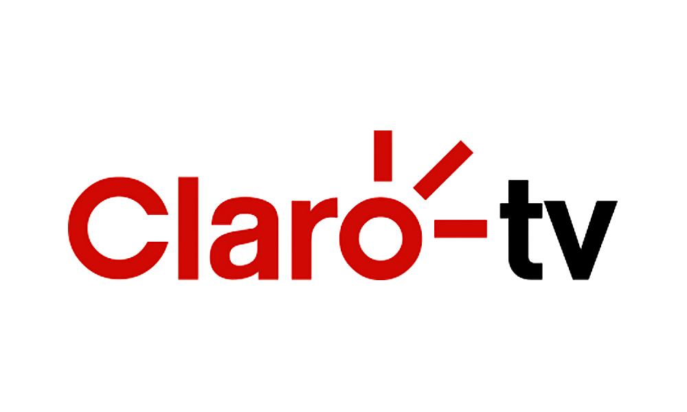

 [![BuyMeCoffee][buymecoffeebedge]][buymecoffee]

# Claro TV Sensor Component



Componente customizado para obter informações sobre a programação da Claro TV no home assistant.

# Instalação

## HACS

- Tenha o [HACS] (https://hacs.xyz/) instalado, isso permitirá que você atualize facilmente.
- Adicione https://github.com/hudsonbrendon/sensor.clarotv como um repositório personalizado do Tipo: Integração
- Clique em Instalar na integração "Clarotv".
- Reinicie Home-Assistant.

## Manual

- Copie o diretório custom_components/clarotv para o seu diretório <config dir>/custom_components.
- Configure.
- Reinicie o Home-Assistant.

# Configuração

```yaml
- platform: clarotv
  channel_id: channel_id
  channel_name: channel_name
  channel_logo: channel_logo
```

## Configurand o channel_name

Você pode dar o nome que quiser ao seu canal, eu sempre sigo o padrão de nomear com o canal que estou configurando.

## Obtendo o channel_id

Acesse a página da [grade de canais](https://www.claro.com.br/tv-por-assinatura/programacao/grade), seleciona o canal desejado.

O **channel_id** se encontra no fim da URL da página do canal que você acessou, por exemplo: https://www.claro.com.br/tv-por-assinatura/programacao/grade/programa/off/1056

Onde **1056** é o **channel_id**.

## Obtendo o channel_logo

Você pode usar qualquer url de imagem, mas eu recomendo utilizar a imagem disponível na própria página do canal que você acessou acima. Para isso, clique com o botão direito do mouse sobre a imagem, e selecione a opção **Copiar endereço da imagem**.

Example:

```yaml
- platform: clarotv
  channel_id: 1056
  channel_name: Off
  channel_logo: https://www.claro.com.br/imagem/canal-off-1509144657569.jpg
```

# Suporte ao card Upcoming media card

Para visualizar a programação do canal configurado, usamos o [upcoming-media-card](https://github.com/custom-cards/upcoming-media-card)

instale via hacs e adicione a configuração abaixo (Lembre-se de substituir sensor.off pelo seu sensor configurado),  em um cartão do tipo manual adicione:

```yaml
type: custom:upcoming-media-card
entity: sensor.off
title: Canal Off
```

# Debugando

```yaml
logger:
  default: info
  logs:
    custom_components.clarotv: debug
```

[buymecoffee]: https://www.buymeacoffee.com/hudsonbrendon
[buymecoffeebedge]: https://camo.githubusercontent.com/cd005dca0ef55d7725912ec03a936d3a7c8de5b5/68747470733a2f2f696d672e736869656c64732e696f2f62616467652f6275792532306d6525323061253230636f666665652d646f6e6174652d79656c6c6f772e737667